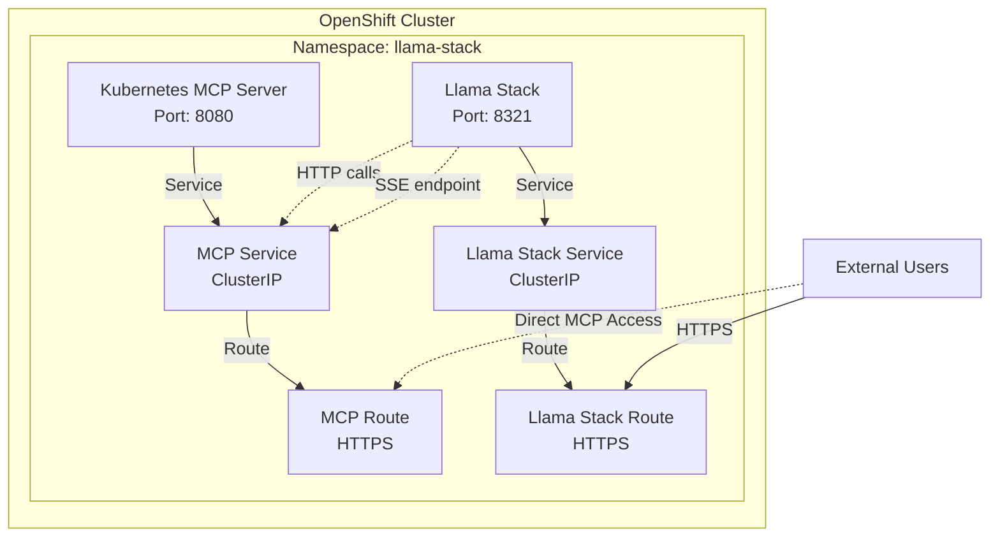

# Guía de Despliegue: Llama Stack con Kubernetes MCP Server

Esta guía describe cómo desplegar Llama Stack junto con un servidor MCP (Model Context Protocol) de Kubernetes como servicios separados en OpenShift.

## 📋 Arquitectura



## 🚀 Despliegue Rápido

### Método 1: Script Automatizado (Recomendado)

```bash
# Despliegue completo
./deploy-with-mcp.sh -n llama-stack

# Solo verificar (dry-run)
./deploy-with-mcp.sh -n llama-stack --dry-run

# Configuración personalizada
./deploy-with-mcp.sh -n my-namespace -f values-production.yaml
```

### Método 2: Despliegue Manual

```bash
# 1. Crear namespace
oc create namespace llama-stack

# 2. Desplegar MCP Server
helm install kubernetes-mcp-server ./charts/kubernetes-mcp-server \
  --namespace llama-stack \
  --values ./charts/kubernetes-mcp-server/values-production.yaml \
  --wait

# 3. Verificar MCP Server
kubectl wait --for=condition=available --timeout=300s \
  deployment/kubernetes-mcp-server -n llama-stack

# 4. Desplegar Llama Stack
helm install llama-stack ./charts/llama-stack \
  --namespace llama-stack \
  --set env.KUBERNETES_MCP_URL=http://kubernetes-mcp-server:8080 \
  --wait
```

## 🔧 Configuración Avanzada

### Configuración del MCP Server

Edita `charts/kubernetes-mcp-server/values.yaml`:

```yaml
# Recursos para producción
resources:
  requests:
    cpu: 500m
    memory: 512Mi
  limits:
    cpu: 1000m
    memory: 1Gi

# Autoscaling
autoscaling:
  enabled: true
  minReplicas: 2
  maxReplicas: 5
  targetCPUUtilizationPercentage: 70

# Permisos RBAC personalizados
rbac:
  rules:
    - apiGroups: [""]
      resources: ["pods", "services"]
      verbs: ["get", "list", "watch"]  # Solo lectura
```

### Variables de Entorno

```bash
# Configurar URLs personalizadas
export KUBERNETES_MCP_URL=http://my-mcp-server:8080
export KUBERNETES_MCP_API_TOKEN=my-secret-token

# Desplegar con configuración personalizada
./deploy-with-mcp.sh
```

## 🔍 Verificación

### 1. Estado de los Pods

```bash
# Ver todos los recursos
kubectl get all -n llama-stack

# Ver logs del MCP Server
kubectl logs -l app.kubernetes.io/name=kubernetes-mcp-server -n llama-stack

# Ver logs de Llama Stack
kubectl logs -l app.kubernetes.io/name=llama-stack -n llama-stack
```

### 2. Conectividad MCP

```bash
# Port-forward para pruebas locales
kubectl port-forward svc/kubernetes-mcp-server 8080:8080 -n llama-stack

# Probar health endpoint
curl http://localhost:8080/health

# Probar SSE endpoint
curl http://localhost:8080/sse
```

### 3. URLs de Acceso

```bash
# Obtener URL de Llama Stack
oc get route llama-stack -n llama-stack -o jsonpath='{.spec.host}'

# Obtener URL de MCP Server
oc get route kubernetes-mcp-server -n llama-stack -o jsonpath='{.spec.host}'
```

## 🛡️ Seguridad

### Permisos RBAC por Defecto

El MCP Server se despliega con los siguientes permisos:

- **Pods**: Gestión completa (CRUD)
- **Services**: Gestión completa (CRUD)  
- **ConfigMaps/Secrets**: Gestión completa (CRUD)
- **Deployments**: Gestión completa (CRUD)
- **Jobs/CronJobs**: Gestión completa (CRUD)

### Personalizar Permisos

Para un entorno más restrictivo:

```yaml
# values-readonly.yaml
rbac:
  rules:
    - apiGroups: [""]
      resources: ["pods", "services"]
      verbs: ["get", "list", "watch"]  # Solo lectura
    - apiGroups: ["apps"]
      resources: ["deployments"]
      verbs: ["get", "list", "watch", "patch"]  # Lectura + actualización
```

### Security Context Constraints (OpenShift)

El chart incluye una SCC personalizada:

```yaml
# SCC automática creada
runAsUser:
  type: MustRunAs
  uid: 1001
allowPrivilegeEscalation: false
requiredDropCapabilities: [ALL]
```

## 📈 Monitoring y Observabilidad

### Métricas

El MCP Server expone métricas en:
- Health endpoint: `http://mcp-server:8080/health`
- Kubernetes probes: Configurados automáticamente

### Logs Estructurados

```bash
# Ver logs con timestamps
kubectl logs -f deployment/kubernetes-mcp-server -n llama-stack --timestamps

# Filtrar logs por nivel
kubectl logs deployment/kubernetes-mcp-server -n llama-stack | grep ERROR
```

### Alertas Recomendadas

```yaml
# Ejemplo de PrometheusRule (si tienes Prometheus)
- alert: MCPServerDown
  expr: up{job="kubernetes-mcp-server"} == 0
  for: 5m
  labels:
    severity: critical
  annotations:
    description: "MCP Server ha estado caído por más de 5 minutos"

- alert: MCPHighMemoryUsage
  expr: container_memory_usage_bytes{pod=~"kubernetes-mcp-server-.*"} / 1024^3 > 0.8
  for: 10m
  labels:
    severity: warning
  annotations:
    description: "MCP Server usando más del 80% de memoria"
```

## 🔧 Troubleshooting

### Problemas Comunes

#### 1. MCP Server no inicia

```bash
# Verificar imagen y pull policy
kubectl describe pod -l app.kubernetes.io/name=kubernetes-mcp-server -n llama-stack

# Verificar recursos
kubectl top pod -l app.kubernetes.io/name=kubernetes-mcp-server -n llama-stack

# Ver eventos
kubectl get events --sort-by='.lastTimestamp' -n llama-stack
```

#### 2. Llama Stack no puede conectarse al MCP

```bash
# Verificar service discovery
kubectl get svc kubernetes-mcp-server -n llama-stack

# Verificar conectividad desde Llama Stack pod
kubectl exec -it deployment/llama-stack -n llama-stack -- \
  curl http://kubernetes-mcp-server:8080/health
```

#### 3. Permisos insuficientes

```bash
# Verificar RBAC
kubectl auth can-i list pods \
  --as=system:serviceaccount:llama-stack:kubernetes-mcp-server \
  --namespace=llama-stack

# Ver permisos del ServiceAccount
kubectl describe clusterrolebinding kubernetes-mcp-server
```

#### 4. Problemas de memoria/CPU

```bash
# Verificar límites y requests
kubectl describe deployment kubernetes-mcp-server -n llama-stack

# Ajustar recursos
helm upgrade kubernetes-mcp-server ./charts/kubernetes-mcp-server \
  --namespace llama-stack \
  --set resources.limits.memory=2Gi \
  --set resources.requests.cpu=1000m
```

## 🗑️ Limpieza

### Desinstalar completamente

```bash
# Eliminar Llama Stack
helm uninstall llama-stack -n llama-stack

# Eliminar MCP Server
helm uninstall kubernetes-mcp-server -n llama-stack

# Limpiar recursos RBAC (si es necesario)
kubectl delete clusterrole kubernetes-mcp-server
kubectl delete clusterrolebinding kubernetes-mcp-server

# Eliminar namespace
kubectl delete namespace llama-stack
```

### Limpieza parcial

```bash
# Solo eliminar MCP Server
helm uninstall kubernetes-mcp-server -n llama-stack

# Solo eliminar Llama Stack  
helm uninstall llama-stack -n llama-stack
```

## 📚 Recursos Adicionales

- [Documentación del Chart MCP](./charts/kubernetes-mcp-server/README.md)
- [Documentación del Chart Llama Stack](./charts/llama-stack/README.md)
- [Model Context Protocol Specification](https://spec.modelcontextprotocol.io/)
- [OpenShift Documentation](https://docs.openshift.com/)

## 🤝 Contribuir

Para contribuir a estos charts:

1. Fork el repositorio
2. Crea una rama feature: `git checkout -b feature/nueva-funcionalidad`
3. Realiza tus cambios
4. Ejecuta las validaciones: `helm lint charts/*/`
5. Envía un Pull Request

## 📄 Licencia

Este proyecto está licenciado bajo la Licencia MIT - ver el archivo [LICENSE](LICENSE) para detalles.
